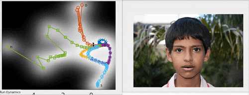

# Mother and Son

### Dependencies
After cloning the repository manually download:
- [[2](#second)]. and extract the `aasthana_cvpr2013_code_version_2.0.zip` under `libraries/landmarks extraction/AA/` folder.
- [[4](#fourth)] and extract the `toolbox-master.zip` under `libraries/toolbox/` folder.

If you intend to use OpenFace as landmark extractor, install the library following [[5](#fifth)] and place the `bin` folder under `libraries/landmarks extraction/OF/`.

### Demo
Run `mainMotherSon`, choose mother(s) data and the example `son.jpg` image as son's neutral image.

### Features done
- Included support to mother data acquired via images.
- Included support to multiple "mothers".
- Included four landmark extraction methods (Zhu-Ramanan [[1](#first)], Aashtana [[2](#second)], TCDCN [[3](#third)] and OpenFace [[5](#fifth)]).
- Included webcam modality for son acquisition.
- Inserted option to handle color images.
- Code refactored using MATLAB classes.
- Faster face texture reconstruction.
- Corrected action parameters.

### Features to do
- Include mother acquisition via webcam.

### Credits
**Mother and Son** is a [PHuSe Lab](http://phuselab.di.unimi.it/) project in collaboration with the Département Informatique - Ecole Polytechnique de l'Université François Rabelais de Tours, France.
- Giuseppe Boccignone <giuseppe.boccignone@unimi.it>
- Vittorio Cuculo <vittorio.cuculo@unimi.it>
- Raffaella Lanzarotti <lanzarotti@di.unimi.it>
- Donatello Conte <donatello.conte@univ-tours.fr>

<a name="first">[1]</a>: http://www.ics.uci.edu/~xzhu/face/ "X. Zhu, D. Ramanan. \"Face detection, pose estimation and landmark localization in the wild\" Computer Vision and Pattern Recognition (CVPR) Providence, Rhode Island, June 2012."  
<a name="second">[2]</a>: http://ibug.doc.ic.ac.uk/resources/drmf-matlab-code-cvpr-2013/ "A. Asthana, S. Zafeiriou, S. Cheng and M. Pantic. Robust Discriminative Response Map Fitting with Constrained Local Models. In CVPR 2013."  
<a name="third">[3]</a>: http://mmlab.ie.cuhk.edu.hk/projects/TCDCN.html "Zhanpeng Zhang, Ping Luo, Chen Change Loy, Xiaoou Tang. Facial Landmark Detection by Deep Multi-task Learning, in Proceedings of European Conference on Computer Vision (ECCV), 2014"  
<a name="fourth">[4]</a>: https://pdollar.github.io/toolbox/  
<a name="fifth">[5]</a>: https://github.com/TadasBaltrusaitis/OpenFace/wiki "Baltrušaitis, T., Robinson, P., & Morency, L. P. (2016, March). Openface: an open source facial behavior analysis toolkit. In Applications of Computer Vision (WACV), 2016 IEEE Winter Conference on (pp. 1-10). IEEE."

### Acknowledgement

The son demo picture `/Data/images/son.jpg` is by Muhammad Mahdi Karim (www.micro2macro.net) Facebook Youtube - Own work, CC BY-SA 2.5-2.0-1.0, https://commons.wikimedia.org/w/index.php?curid=4155050
